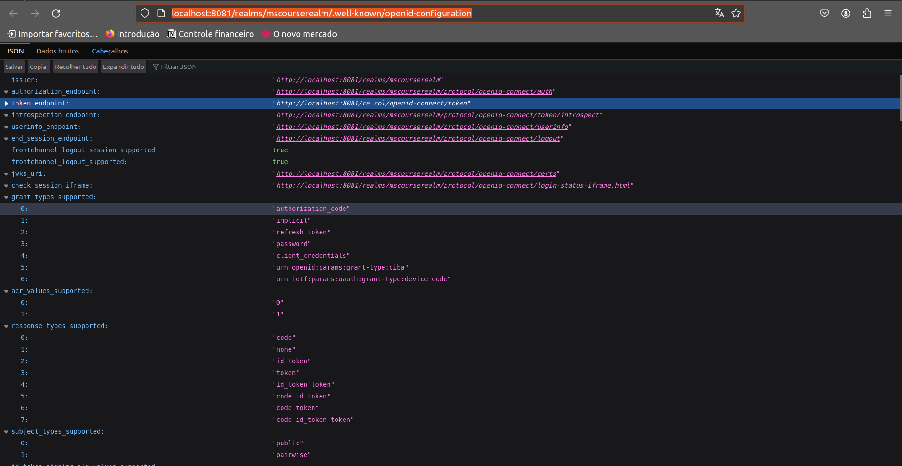

# Getting Started

### Tecnologias envolvidas
- Arquitetura Completa de Microservices
- Java 17, SpringBoot 3.2.1
- Spring Cloud, Service Discovery, Api Gateway, Loadbalancer
- Spring Cloud Open Feign para comunicação Sícrona entre os Microservices
- Serviços de Mensageria com RabbitMQ
- Authorization Server com Keycloak
- Imagens Docker e containers 

### Instalação necessário

##### Configurar RabbitMQ image
- Fazer o pull da imagem do Dockerfile
- Comando docker run -it --name rabbitmq -p 5672:5672 -p 15672:15672 rabbitmq:3.12.12-management
- Entrar no painel de admin(porta 15672) com user e senha "guest"
- Criar uma fila indo na aba "Queues and Streaming" e selecionando "add new Queue"
- Colocar o nome "emissao-cartoes" e adicionar com o Type = "Classic"

### Configurar KeyCloak
Doc:https://www.keycloak.org/getting-started/getting-started-docker
- Comando docker run -p 8081:8080 -e KEYCLOAK_ADMIN=admin -e KEYCLOAK_ADMIN_PASSWORD=admin quay.io/keycloak/keycloak:23.0.6 start-dev
- Ou rodar o serviço "keycloak" em docker-compose.yml
- Entrar no painel do admin (8081) com user e senha "admin"
- Criar realm "mscourserealm"
- Utilizar agora a url http://localhost:8081/realms/mscourserealm/.well-known/openid-configuration e pegar a url do token_endpoint
- 
- Com o ClientId, ClientSecret e tokenUrl você consegue gerar tokens para utilizar na aplicação

### Passo a passo (fluxo)
    1-Criar cliente (http://localhost:8080/clientes)
    2-Criar cartões com um range menor ou igual do cliente(http://localhost:8080/cartoes)
    3-Fazer avaliação do cliente(http://localhost:8080/avaliacoes-credito)
    4-Fazer solicitação da emissão do cartão disponível no 3ª passo (http://localhost:8080/avaliacoes-credito/solicitacoes-cartao)

### Mapeamento das rotas da API